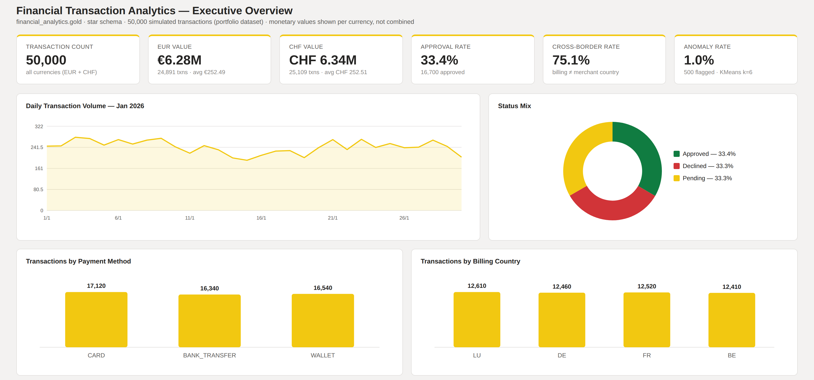
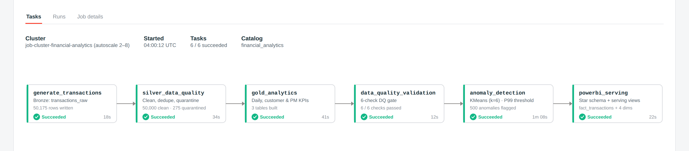
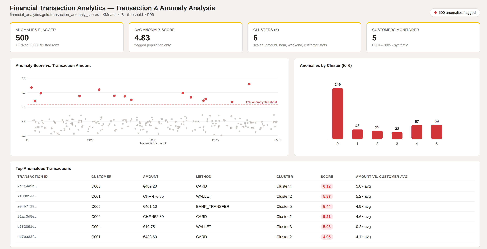

# Financial Transaction Analytics Data Product

An end-to-end financial transaction analytics data product built with **Databricks, PySpark, SQL, Delta Lake and Power BI**.

The project demonstrates how raw financial transaction data can be transformed into trusted analytical datasets through automated data-quality controls, anomaly detection, dimensional modelling and workflow orchestration.

> **Data note:** The project uses 50,000 fully simulated financial transactions. No real customer, company or financial transaction data is included.

---

## Executive Overview



The analytical layer provides management-level visibility into transaction volume, transaction value by currency, approval rates, cross-border activity, payment methods and anomaly rates.

EUR and CHF monetary values are intentionally reported separately to avoid aggregating different currencies without an FX conversion layer.

---

## Architecture

The solution follows a **Medallion Architecture**:

```text
Synthetic Transactions
        │
        ▼
┌─────────────────────┐
│       BRONZE        │
│ Raw Delta records   │
└──────────┬──────────┘
           │
           ▼
┌─────────────────────┐
│       SILVER        │
│ Validate            │
│ Clean               │
│ Deduplicate         │
│ Quarantine          │
└──────────┬──────────┘
           │
           ▼
┌─────────────────────┐
│        GOLD         │
│ Business KPIs       │
│ Customer Metrics    │
│ Payment Analytics   │
└──────────┬──────────┘
           │
      ┌────┴─────┐
      ▼          ▼
 Data Quality   PySpark ML
    Gate        Anomaly Detection
      │          │
      └────┬─────┘
           ▼
      Star Schema
           │
           ▼
        Power BI
```

The Medallion Architecture controls data processing and quality, while the star schema provides a business-friendly analytical model for Power BI.

---

## Databricks Pipeline



The complete workflow is orchestrated through Databricks Jobs:

```text
generate_transactions
        ↓
silver_data_quality
        ↓
gold_analytics
        ↓
data_quality_validation
        ↓
anomaly_detection
        ↓
powerbi_serving
```

Pipeline stages communicate through persisted Delta tables rather than notebook-local variables, allowing each processing stage to execute independently within the workflow.

---

## Data Quality

Controlled quality issues are introduced into the raw synthetic dataset to demonstrate validation and quarantine logic.

The Bronze dataset contains **50,175 records**, including deliberately introduced:

- missing transaction IDs
- negative transaction amounts
- unsupported currencies
- duplicate transactions

The Silver layer validates, cleans and deduplicates the data.

The resulting trusted dataset contains:

**50,000 rows → 50,000 unique transaction IDs**

Automated quality controls validate:

- dataset availability
- non-null transaction IDs
- transaction ID uniqueness
- positive transaction amounts
- supported currencies
- supported transaction statuses

The data-quality validation stage acts as a **pipeline gate**. Downstream anomaly processing is stopped when critical validation rules fail.

---

## Gold Analytical Layer

Business-ready datasets are generated for:

- daily transaction KPIs
- customer behaviour
- payment-method performance
- approval and decline rates
- cross-border activity
- anomaly investigation

The Gold layer separates reusable analytical logic from raw transaction processing and provides curated datasets for downstream reporting.

---

## Anomaly Detection



A simple unsupervised anomaly-detection pipeline is implemented using **PySpark ML and KMeans clustering**.

Features include transaction and behavioural characteristics such as:

- transaction amount
- customer average transaction amount
- customer transaction variability
- customer transaction frequency
- transaction hour
- weekend indicator
- amount relative to customer average

Features are assembled and standardized before clustering.

Each transaction receives an anomaly score based on its distance from its assigned cluster centre.

Transactions at approximately the **99th percentile (P99)** of anomaly scores are flagged for investigation.

Approximately:

```text
50,000 trusted transactions
        ↓
KMeans clustering (k = 6)
        ↓
Distance-based anomaly score
        ↓
P99 threshold
        ↓
~500 transactions flagged
```

> Anomalies represent statistically unusual transactions and are **not classified as confirmed fraud**. Confirmed fraud labels would be required for supervised fraud modelling and model-performance evaluation.

---

## Power BI Star Schema

The serving layer exposes a dimensional model containing:

```text
                 dim_date
                    │
                    │
dim_customer ── fact_transactions ── dim_payment_method
                    │
                    │
               dim_currency
```

### Fact table

`fact_transactions`

### Dimensions

- `dim_date`
- `dim_customer`
- `dim_payment_method`
- `dim_currency`

Relationships use **one-to-many, single-direction filtering** from dimensions to the transaction fact table.

This structure supports reusable DAX measures, efficient filtering and self-service analysis.

---

## Power BI Reporting

The reporting layer contains three analytical perspectives:

**Executive Overview**  
Management-level transaction KPIs, currency-specific transaction values, approval performance, cross-border activity and payment behaviour.

**Transaction & Anomaly Analysis**  
Anomaly scores, cluster behaviour, transaction-level investigation and unusual customer activity.

**Customer Analytics**  
Customer transaction value, frequency, average ticket and anomaly behaviour.

---

## Repository Structure

```text
financial-transaction-analytics-databricks/
│
├── notebooks/
│   ├── 02_generate_transactions.py
│   ├── 03_silver_data_quality.py
│   ├── 04_gold_analytics.py
│   ├── 05_data_quality_validation.py
│   └── 06_anomaly_detection.py
│
├── sql/
│   ├── 07_powerbi_serving_layer.sql
│   └── 08_powerbi_star_schema.sql
│
├── tests/
│   └── validation_queries.sql
│
├── docs/
│   ├── architecture.md
│   ├── data_dictionary.md
│   └── project_overview.md
│
├── powerbi/
│   └── README.md
│
├── images/
│   ├── executive_overview.png
│   ├── databricks_pipeline.png
│   └── anomaly_analysis.png
│
├── .gitignore
├── LICENSE
└── README.md
```

---

## Technology Stack

| Area | Technology |
|---|---|
| Data Platform | Databricks |
| Distributed Processing | PySpark |
| Data Storage | Delta Lake |
| Querying | Spark SQL / SQL |
| Architecture | Medallion Architecture |
| Data Quality | PySpark validation & quarantine |
| Machine Learning | PySpark ML / KMeans |
| Orchestration | Databricks Jobs |
| Analytical Modelling | Star Schema |
| Business Intelligence | Power BI / DAX |
| Version Control | Git / GitHub |

---

## Key Design Principles

**Data quality before analytics** — invalid records are isolated before entering trusted analytical datasets.

**Persisted data contracts** — pipeline stages communicate through Delta tables rather than temporary notebook state.

**Clear analytical grain** — the transaction fact maintains one row per transaction.

**Currency integrity** — EUR and CHF values remain separate unless an explicit FX conversion layer is introduced.

**Anomaly ≠ fraud** — unsupervised statistical anomalies are treated as investigation signals rather than confirmed fraudulent transactions.

**Separation of concerns** — ingestion, data quality, business analytics, ML and BI serving responsibilities are separated across processing stages.

---

## Project Scope

This repository is a **portfolio implementation using simulated data** designed to demonstrate end-to-end data-product engineering and analytics concepts.

Production extensions could include streaming ingestion, incremental Delta processing, formal schema contracts, model monitoring, CI/CD, additional observability, FX conversion and supervised fraud modelling using independently confirmed outcome labels.
